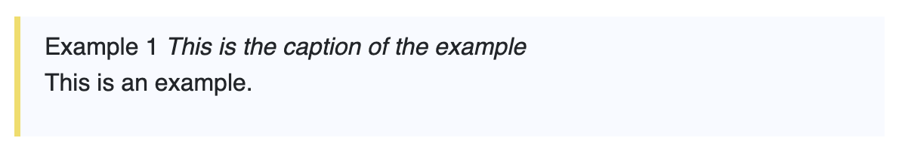
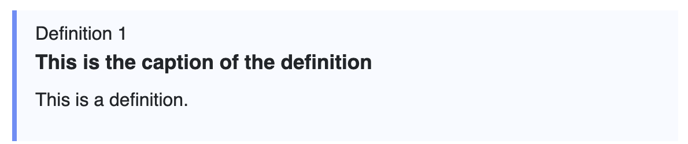
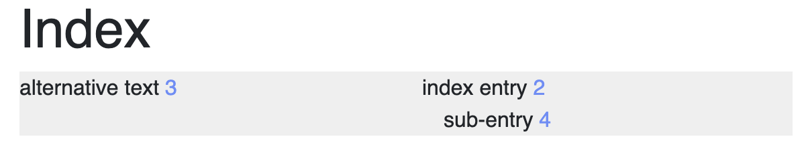

# Welcome to the llsoftsecbook contributing guide

We are looking forward to your contributions and are happy you found your way to
this contributing guide. Thank you for investing your time in contributing to
our project!


## What types of contributions are we looking for?

We are looking for a variety of contributions, including, but not limited, to:
- Reports on how to improve spelling, grammar, style or other linguistic aspects
  of the book.
- Ideas for new content, or for how to present existing content in an
  alternative way to make it easier to digest.
- Patches improving existing content or adding new content.
- Improvements to the scripts in this project.
- Improvements to the look-and-feel of the produced HTML and PDF output.
- Any other improvements.

## What is the vision for the project?

See https://github.com/llsoftsec/llsoftsecbook/blob/main/README.md#purpose

## Submitting ideas for new content, how to improve language, ...

Please raise an issue at https://github.com/llsoftsec/llsoftsecbook/issues/. It
may be a good idea to check if there is already an issue for what you're
planning to report.

## Submitting changes

Please send a GitHub Pull Request (read more about
[pull requests](https://docs.github.com/en/github/collaborating-with-pull-requests/proposing-changes-to-your-work-with-pull-requests/about-pull-requests)).
Please follow our
[style and coding conventions](#style-and-coding-conventions).

### Copyright and license

The copyright on contributions is not transferred. In other words, contributors
retain copyright on their contributions.

If you're making a contribution for the first time, please check if the
copyright owner is listed in the header under the "copyright:" tag at
https://github.com/llsoftsec/llsoftsecbook/blob/main/book.md?plain=1. If not,
please do add a line with "SPDX-FileCopyrightText" under the "copyright:" header
so that the copyright notices for this project remain well-maintained.

The license used for this project is
https://creativecommons.org/licenses/by/4.0/.

The lua scripts in this repository are licensed under the MIT license.

### Planning changes

If you're planning to fix a non-trivial reported issue or to add new content,
please do let us know. This could be as simple as assigning the issue for it to
yourself. Or you could also comment on the relevant issue, or start a
[discussion thread](https://github.com/llsoftsec/llsoftsecbook/discussions).

If you are looking for a good first issue to work on, the issues labeled with
"[good
first issue](https://github.com/llsoftsec/llsoftsecbook/issues?q=is%3Aissue+is%3Aopen+label%3A%22good+first+issue%22)" may be good candidates.

## Other ways to get in touch

If you'd like to get in touch and Issues do not seem to be the right way to
communicate, please use [Discussions](<https://github.com/llsoftsec/llsoftsecbook/discussions>).

If you prefer to have an interactive chat with other contributors and readers,
please join [our Discord server](https://discord.gg/Bm55Z9Ppgn).

## Style and coding conventions

- We use [pandoc markdown](https://pandoc.org/MANUAL.html#pandocs-markdown).
- We favor incremental development of the book. Specifically,
  - We aim for individual commits adding new content to not be overly large, but
    remain focussed on a specific topic.
  - We aim for commits fixing style, spelling or other language issues to fix
    one general issue at a time.
  - When writing new content, do use todos to indicate if some detail should or
    could be added later. Similar to how TODO or FIXME comments are used in code
    projects, we use todos to indicate an improvement that should be made later.
    We hope that by using todos, contributors will wrestle a bit less with
    writer's block. For "inline" todos, i.e. a todo that strongly correlates to
    a specific sentence, we used the pandoc
    [bracketed span](https://pandoc.org/MANUAL.html#extension-bracketed_spans)
    syntax. This looks as follows: ``[todo text]{.todo}``

    For "block" todos, i.e. a todo that is better as a standalone paragraph, for
    example because it describes an improvement for a whole section, we use the
    pandoc [fenced div](https://pandoc.org/MANUAL.html#extension-fenced_divs)
    syntax. That looks as follows:

    ```
    ::: TODO
    todo text
    :::
    ```

- For now, we keep all text content of the book in a single
  [book.md](https://github.com/llsoftsec/llsoftsecbook/blob/main/book.md) file.
- When adding new content, please remember to:
  - Spell check your contributions. We use US English spelling.
  - Add index entries as needed to make sure the index of the book remains
    up-to-date.
- If the copyright owner of what you're adding is not already listed in the
  header of
  [book.md](https://github.com/llsoftsec/llsoftsecbook/blob/main/book.md) under
  'copyright:', please add a SPDX-FileCopyrightText item.
- We've written a number of lua scripts to allow us to extend pandoc's
  capabilities in a few areas. These enable a few new markdown constructs,
  explained in the following sections.

### Use of Example, Definition environments

The book uses many examples to explain concepts. In some places, it also
explicitly defines terms. To make these stand out, we use special environments
for them.

To create an example, use the following syntax:

```markdown
::: {.example #ex:example-example
     caption="This is the caption of the example"}
This is an example.
:::
```

As you can see, this uses the standard
[pandoc fenced div syntax](https://pandoc.org/MANUAL.html#extension-fenced_divs).
Every div with the class `example` is treated as an example. The optional
`caption` attribute can be used to provide a caption for the example. The
optional `#ex:example-example` identifier provides a label for the example, so
that it can be referred to from other parts of the book using
`@ex:example-example`. For this to work, the identifier must start with `ex:`.
Example numbers are automatically generated.

The above example would be rendered in HTML as follows:



Similarly, definitions can be created using the following syntax:

```markdown
::: {.definition #def:example-definition
     caption="This is the caption of the definition"}
This is a definition.
:::
```

Definition identifiers must start with `def:`.

The above definition would be rendered in HTML as follows:



### Refering to sections, figures, examples, definitions

Sections, figures, examples and definitions can be referred to using the
`@sec:`, `@fig:`, `@ex:` and `@def:` prefixes, respectively. For example,
`@sec:introduction` refers to the section with the identifier
`#sec:introduction`. Similarly, `@fig:some-figure` refers to the figure with the
identifier `#fig:some-figure`.

### How to add index entries

Pandoc markdown does not have built-in support for index entries. Therefore, we
use a custom lua script to add this functionality. To add an index entry, use
the following syntax: `This will become an [index entry]{.index}`

This uses the
[pandoc markdown bracketed span](https://pandoc.org/MANUAL.html#extension-bracketed_spans)
syntax. The text inside the square brackets is the text that will appear in the
index. The `.index` class tells the lua script that this is an index entry.

If you want a different text to appear in the index than what is visible in the
main text, you can use the following syntax:
`This will become an [index entry]{.index entry="alternative text"}`. As you can
see, the `entry` attribute specifies the text that will appear in the index.

If you want to create a sub-entry in the index, you can use the `!` character to
separate the main entry from the sub-entry. For example,
`This will become an [index entry]{.index entry="index entry!sub-entry"}` will
create a main entry "index entry" with a sub-entry "sub-entry".

All index entries are automatically sorted alphabetically and inserted into the
div with the id `index`.

The 3 example index entries above would be rendered in HTML as follows:



### General style and grammar conventions

- We use US English spelling.
- We favor simple language over complicated language.
- If in doubt, we'll consult the
  [Chicago Manual of Style](https://www.chicagomanualofstyle.org/home.html) as
  it is a de facto standard.

### Diagrams and images

When diagrams or images are needed in the book, we encourage drawing them with
https://github.com/jgraph/drawio-desktop/. Inkscape can also be used to draw
them, but may be a bit more cumbersome to use for technical diagrams.

We use SVG as the image source format. The sources are stored in the `img`
sub-directory.

For the HTML output, the SVG images are included as is.  For the PDF output,
the SVGs are automatically converted to PDFs.  If you edit or add an SVG image,
make sure to check the PDF output to see if the conversion worked as expected.
A common issue that can happen during conversion to PDF is explained at
https://www.diagrams.net/doc/faq/svg-export-text-problems.

## How to build/test
- See <https://github.com/llsoftsec/llsoftsecbook/blob/main/README.md#build-instructions>.
- The project has [CI
  setup](https://github.com/llsoftsec/llsoftsecbook/actions/workflows/main.yml),
  which checks that the PDF and HTML versions of the book build without error
  messages. It also publishes the top-of-tree version of the book at
  <https://llsoftsec.github.io/llsoftsecbook/>.

## Attribution

We follow <https://allcontributors.org/> to recognize all contributors.
